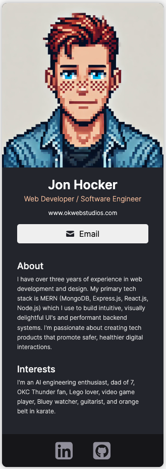

<h1 align="center">Digital Business Card</h1>

This project demonstrates a digital business card built with React, featuring customizable profile information, contact details, and social media links. 

## Table of Contents
  - [Features](#features)
  - [Example](#example)
  - [Technologies Used](#technologies-used)
  - [Installation Instructions](#installation-instructions)
  - [Deployment](#deployment)
  - [License](#license)
  - [Acknowledgements](#acknowledgements)

## Features
- **Profile Picture**: Displays a profile image of the individual.
- **Name and Title**: Shows the name and professional title of the individual.
- **Website Link**: Provides a link to the individual's website.
- **Email Button**: Includes a button to send an email to the individual.
- **About Section**: Describes the individual's background and experience.
- **Interests Section**: Lists the individual's personal interests.
- **Social Media Icons**: Links to the individual's social media profiles.

## Example
<p align="center">
  <p align="center">
    <a href="https://digital-biz-card.netlify.app" target="_blank" rel="noopener noreferrer">
      
    </a>
  </p>

## Technologies Used
- React
- CSS
- Node.js
- Vite.js

## Installation Instructions
You can use this project to create your own digital business card. Follow the steps below to customize it for yourself:

### Prerequisites
- [Node.js](https://nodejs.org/en/)
- [npm](https://www.npmjs.com/)

### Steps
1. Clone the repository:
   ```sh
   git clone https://github.com/jhock9/digital-biz-card.git
   ```

2. Navigate to the project directory:
   ```sh
   cd digital-biz-card
   ```

3. Install the dependencies:
   ```sh
   npm install
   ```

4. Start the development server:
   ```sh
   npm start
   ```

5. Customize the content:
   - Open the project in your favorite code editor and update:
     - Profile picture url
     - Name
     - Job title
     - Website url
     - Email button url
     - About section
     - Interests section
     - Social media icons & urls

6. Build for production:
   ```sh
   npm run build
   ```

## Deployment
This project is deployed on Netlify and can be accessed [here](https://digital-biz-card.netlify.app).

## License
This project is licensed under the MIT License.

## Acknowledgements
This project is part of [Scrimba](https://v2.scrimba.com/)'s [AI Engineering Course](https://v2.scrimba.com/the-ai-engineer-path-c02v)